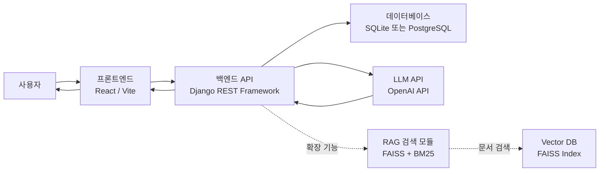
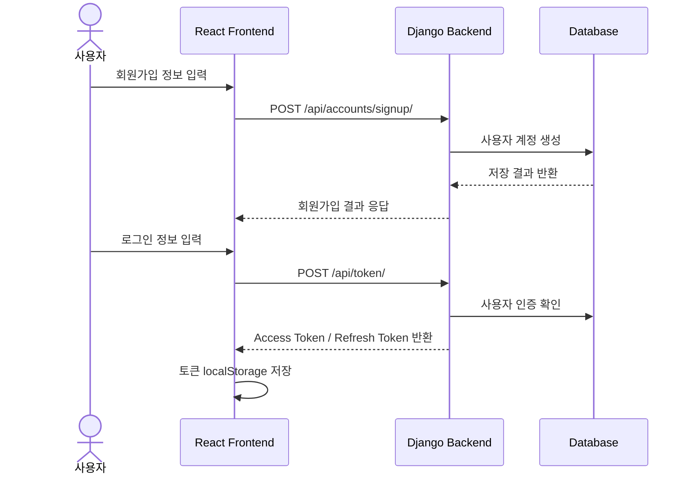
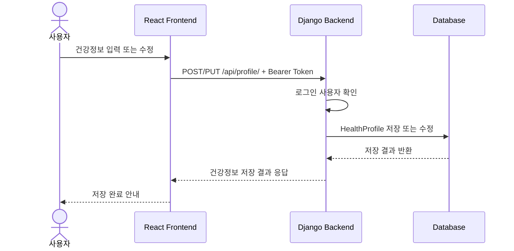
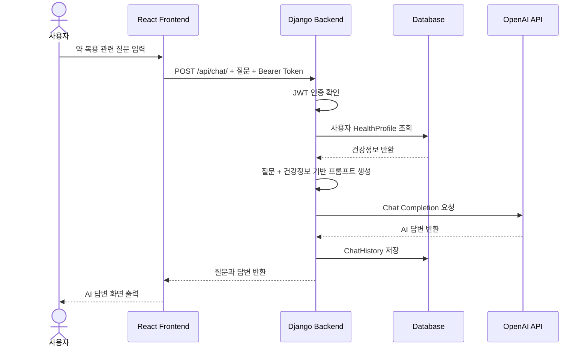
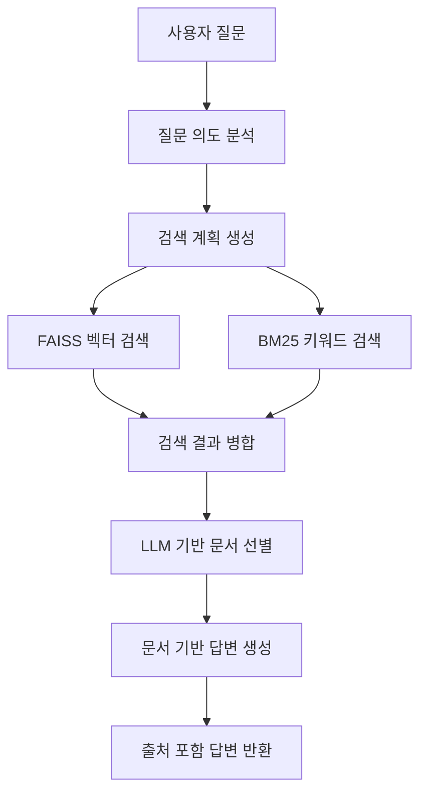
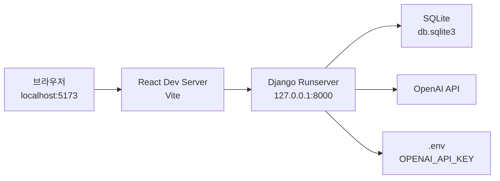
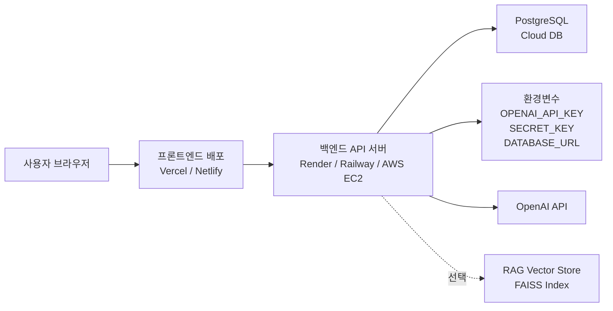

# MediPill AI 시스템 구성도

## 1. 문서 개요

본 문서는 MediPill AI Web Application의 전체 시스템 구조를 설명하기 위한 시스템 구성도 문서이다.

사용자, 프론트엔드, 백엔드, 데이터베이스, LLM API, RAG 구성 요소가 어떤 관계로 연결되는지 정리하고, 사용자 질문 입력부터 AI 답변 출력까지의 데이터 흐름을 설명한다.

## 2. 전체 시스템 구성

MediPill AI는 React 기반 프론트엔드와 Django 기반 백엔드가 분리된 구조로 동작한다. 사용자는 브라우저에서 질문을 입력하고, 프론트엔드는 Django API로 요청을 전달한다. Django 백엔드는 사용자 건강정보를 조회한 뒤 OpenAI API를 호출하여 AI 답변을 생성하고, 상담 이력을 데이터베이스에 저장한다.



## 3. 구성 요소별 역할

| 구성 요소 | 사용 기술 | 주요 역할 |
|---|---|---|
| 사용자 | Web Browser | 회원가입, 로그인, 건강정보 입력, 질문 입력, 답변 확인 |
| 프론트엔드 | React, JavaScript, CSS, Axios | 화면 표시, 사용자 입력 처리, API 요청, JWT 토큰 전달 |
| 백엔드 | Django, Django REST Framework | 인증, 건강정보 관리, 상담 요청 처리, LLM 호출, 상담 이력 저장 |
| 인증 | SimpleJWT | Access Token, Refresh Token 발급 및 인증 처리 |
| 데이터베이스 | SQLite, PostgreSQL 예정 | 사용자 정보, 건강정보, 상담 이력 저장 |
| LLM 연동 | OpenAI API | 사용자 질문에 대한 AI 답변 생성 |
| RAG 모듈 | LangChain, FAISS, BM25 | 문서 기반 검색 및 답변 근거 강화 |
| 환경변수 | `.env` | OpenAI API Key, Secret Key, DB URL 등 비밀값 관리 |

## 4. 주요 기능별 시스템 관계

## 4.1 회원가입 및 로그인

회원가입과 로그인은 사용자별 건강정보와 상담 이력을 분리하기 위한 기반 기능이다.



## 4.2 건강정보 등록 및 수정

건강정보는 AI 답변을 개인화하기 위한 핵심 데이터이다.



## 5. AI 상담 데이터 흐름

AI 상담 기능은 MediPill AI의 핵심 기능이다. 사용자의 질문과 건강정보를 함께 사용하여 LLM 답변을 생성한다.

## 5.1 질문 입력부터 답변 출력까지의 흐름



## 5.2 AI 상담 처리 단계

| 단계 | 처리 위치 | 설명 |
|---|---|---|
| 1. 질문 입력 | 프론트엔드 | 사용자가 질문 입력창에 약 복용 관련 질문 작성 |
| 2. API 요청 | 프론트엔드 | Axios로 Django `/api/chat/`에 질문 전송 |
| 3. 사용자 인증 | 백엔드 | JWT 토큰으로 로그인 사용자 확인 |
| 4. 건강정보 조회 | 백엔드 / DB | 사용자별 HealthProfile 조회 |
| 5. 프롬프트 구성 | 백엔드 | 질문, 건강정보, 주의사항 조건을 조합 |
| 6. LLM 호출 | 백엔드 / OpenAI | OpenAI API에 답변 생성 요청 |
| 7. 답변 저장 | 백엔드 / DB | 질문과 답변을 ChatHistory에 저장 |
| 8. 답변 출력 | 프론트엔드 | 사용자 화면에 Q/A 형태로 표시 |

## 6. RAG 확장 구조

현재 프로젝트의 메인 상담 API는 OpenAI API 직접 호출 구조이며, RAG 코드는 별도 모듈로 존재한다. 향후 RAG를 통합하면 의약품 문서와 DUR 데이터를 검색하여 답변 근거를 강화할 수 있다.



## 6.1 RAG 구성 요소

| 구성 요소 | 역할 |
|---|---|
| Query Analyzer | 질문 의도, 약 이름, 증상, 대상 조건 분석 |
| Retrieval Planner | 검색어와 검색 전략 생성 |
| FAISS Retriever | 임베딩 기반 유사 문서 검색 |
| BM25 Retriever | 키워드 기반 문서 검색 |
| Document Selector | 검색된 문서 중 답변 근거로 사용할 문서 선별 |
| Answer Generator | 선택된 문서를 기반으로 최종 답변 생성 |

## 6.2 현재 RAG 관련 제약

현재 프로젝트에서 RAG는 다음 제약이 있다.

- `data/processed` 폴더가 준비되어 있어야 한다.
- `vectorstore/faiss_index`가 생성되어 있어야 한다.
- Django의 `/api/chat/` 메인 상담 API와 RAG 체인이 아직 완전히 통합되지 않았다.
- 최종 웹 화면에서 참고 문서 또는 출처 표시 기능이 부족하다.

## 7. 로컬 실행 환경 구조

로컬 개발 환경에서는 프론트엔드와 백엔드를 각각 실행한다.



## 7.1 로컬 실행 구성

| 항목 | 로컬 설정 |
|---|---|
| 프론트엔드 실행 | `npm run dev` |
| 프론트엔드 주소 | `http://localhost:5173` |
| 백엔드 실행 | `python manage.py runserver` |
| 백엔드 주소 | `http://127.0.0.1:8000` |
| 데이터베이스 | SQLite |
| API Key | `.env`의 `OPENAI_API_KEY` |

## 8. 클라우드 배포 환경 구조

배포 환경에서는 프론트엔드, 백엔드, 데이터베이스, 환경변수를 분리하여 운영한다.



## 8.1 배포 환경 구성 요소

| 구성 요소 | 배포 방식 | 설명 |
|---|---|---|
| 프론트엔드 | Vercel, Netlify, S3 + CloudFront | React 빌드 결과물을 정적 파일로 배포 |
| 백엔드 | Render, Railway, Fly.io, AWS EC2 | Django API 서버 실행 |
| 데이터베이스 | PostgreSQL | 운영 환경 데이터 저장 |
| 비밀키 | 플랫폼 환경변수 | API Key, Secret Key, DB URL 관리 |
| LLM API | OpenAI API | 외부 LLM 서비스 호출 |

## 8.2 배포 시 필요한 설정

| 항목 | 필요 설정 |
|---|---|
| Django DEBUG | `False` |
| ALLOWED_HOSTS | 백엔드 배포 도메인 등록 |
| CORS_ALLOWED_ORIGINS | 프론트엔드 배포 도메인 등록 |
| API Base URL | 프론트엔드에서 배포된 백엔드 주소 사용 |
| Database | SQLite에서 PostgreSQL로 전환 |
| Secret 관리 | `.env` 대신 클라우드 환경변수 사용 |

## 9. API 구조

프론트엔드는 다음 Django API를 호출한다.

| 기능 | Method | Endpoint | 설명 |
|---|---|---|---|
| 회원가입 | POST | `/api/accounts/signup/` | 사용자 계정 생성 |
| 로그인 | POST | `/api/token/` | JWT 토큰 발급 |
| 토큰 갱신 | POST | `/api/token/refresh/` | Access Token 재발급 |
| 건강정보 조회 | GET | `/api/profile/` | 사용자 건강정보 조회 |
| 건강정보 등록 | POST | `/api/profile/` | 사용자 건강정보 등록 |
| 건강정보 수정 | PUT | `/api/profile/` | 사용자 건강정보 수정 |
| AI 상담 | POST | `/api/chat/` | 질문 전송 및 AI 답변 생성 |
| 상담 이력 | GET | `/api/chat/history/` | 사용자 상담 이력 조회 |

## 10. 기술 스택 정리

| 영역 | 기술 | 사용 목적 |
|---|---|---|
| Frontend | React | 사용자 화면 구성 |
| Frontend Build | Vite | 개발 서버 및 빌드 |
| Styling | CSS | 화면 레이아웃과 스타일 |
| API Client | Axios | 백엔드 API 요청 |
| Backend | Django | 서버 애플리케이션 |
| API | Django REST Framework | REST API 구성 |
| Auth | SimpleJWT | JWT 인증 |
| DB | SQLite | 로컬 개발 DB |
| DB 예정 | PostgreSQL | 배포 운영 DB |
| LLM | OpenAI API | AI 상담 답변 생성 |
| RAG | LangChain, FAISS, BM25 | 문서 기반 검색 확장 |
| Config | python-dotenv, 환경변수 | API Key와 설정값 관리 |

## 11. 시스템 구조 요약

MediPill AI의 시스템은 사용자가 브라우저에서 질문을 입력하면 React 프론트엔드가 Django 백엔드 API로 요청을 보내고, Django 백엔드는 사용자 건강정보를 조회한 뒤 OpenAI API를 호출하여 답변을 생성하는 구조이다.

핵심 데이터 흐름은 다음과 같다.

```text
사용자 질문
→ React 프론트엔드
→ Django 백엔드
→ 사용자 건강정보 조회
→ OpenAI API 호출
→ AI 답변 생성
→ 상담 이력 저장
→ 프론트엔드 답변 출력
```

로컬 환경에서는 React 개발 서버와 Django 개발 서버가 각각 실행되며 SQLite를 사용한다. 배포 환경에서는 프론트엔드 정적 배포, Django API 서버 배포, PostgreSQL DB, 클라우드 환경변수, OpenAI API 연동 구조로 확장한다.

따라서 본 시스템 구성은 사용자, 프론트엔드, 백엔드, 데이터베이스, LLM API 간의 관계를 분리하여 이해할 수 있으며, 향후 RAG 기반 문서검색과 클라우드 배포까지 확장 가능한 구조이다.
